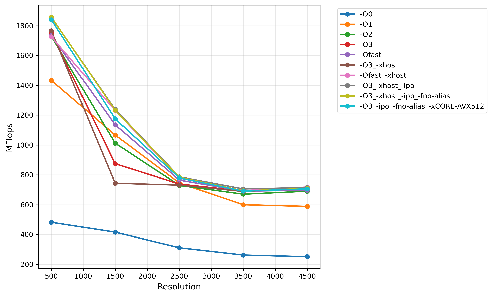
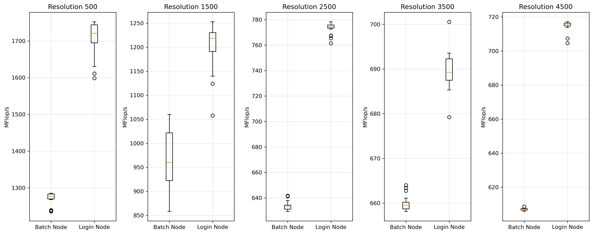
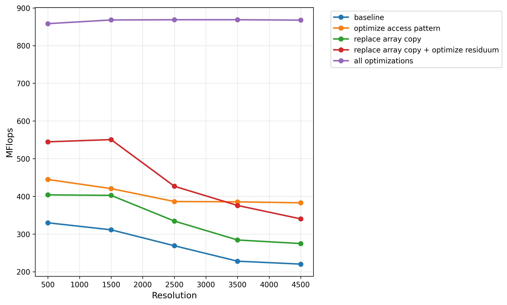
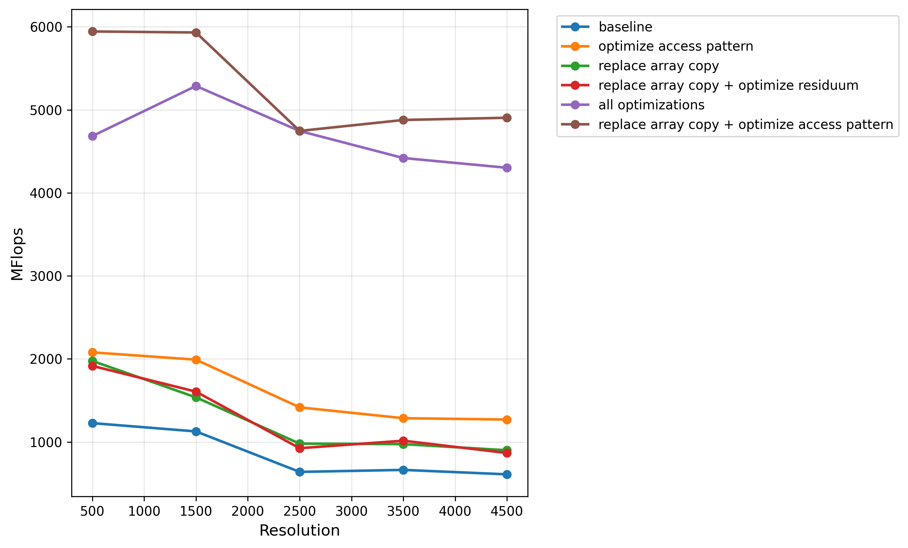

# Report Assignment 1

## Background

FLOP/s (Floating Point Operations per Second) measures computational throughput by counting floating-point arithmetic operations.

## Performance for different compiler flags in MFlop/s

### **-ipo (Inter-Procedural Optimization)**
- Optimizes **across multiple source files** during compilation
- Enables function inlining and cross-file optimizations
- **Impact:** Eliminates function call overhead

### **-fno-alias**
- Assumes **pointers do not alias** (point to same memory)
- Allows more aggressive optimization by removing pointer safety restrictions
- **Impact:** Enables vectorization that would otherwise be blocked

### **ivdep (Ignore Vector Dependencies)**
- **Pragma directive:** `#pragma ivdep` placed before loops
- Tells compiler to **ignore potential dependencies** and vectorize anyway
- **Usage:** Programmer guarantees loop is safe to vectorize

### **-xCORE-AVX512**
- Targets **Intel processors with AVX-512** instruction set
- Generates code with 512-bit vector operations
- **Impact:** Maximum performance on AVX-512 capable hardware

| Optimization Flags                | Resolution 500 | Resolution 1500 | Resolution 2500 | Resolution 3500 | **Resolution 4500** |
|-----------------------------------|----------------|-----------------|-----------------|-----------------|---------------------|
| -O0                               | 482.10         | 415.97          | 311.15          | 262.53          | 251.68              |
| -O1                               | 1433.88        | 1067.15         | 746.10          | 599.92          | 588.59              |
| -O2                               | 1729.75        | 1012.54         | 729.56          | 670.84          | 690.78              |
| -O3                               | 1749.83        | 874.53          | 738.93          | 691.28          | 701.27              |
| -Ofast                            | 1733.54        | 1135.92         | 765.05          | 691.45          | 696.74              |
| -O3 -xhost                        | 1765.77        | 743.96          | 731.83          | 689.18          | 713.23              |
| **-Ofast -xhost**                 | 1725.44        | 1231.55         | 778.34          | 694.75          | **718.89**          |
| -O3 -xhost -ipo                   | 1856.23        | 1237.94         | 786.83          | 706.12          | 715.07              |
| -O3 -xhost -ipo -fno-alias        | 1858.49        | 1233.42         | 783.88          | 693.34          | 708.90              |
| -O3 -ipo -fno-alias -xCORE-AVX512 | 1840.33        | 1175.70         | 779.59          | 691.10          | 706.63              |



## Intel Compiler Optimization Report Analysis

### Findings:
- **Code is successfully vectorized** - Multiple loops show `LOOP WAS VECTORIZED`
- **Loop interchange applied** - Compiler reordered loops (j,i) → (i,j) for better cache performance
- **Using 256-bit YMM registers** instead of 512-bit ZMM registers
- **Loop multiversioning** - Compiler created vectorized + scalar versions for safety
- **Memory dependencies detected** - Some loops have potential data dependencies

### Answers to Questions:
- **Is code vectorized?** YES - Critical loops are vectorized
- **What is -qopt-zmm-usage?** Forces compiler to use 512-bit ZMM (AVX-512) instead of 256-bit YMM registers
- **Performance impact:** Vectorization + loop optimizations explain the significant speedups observed

```C
//
// ------- Annotated listing with optimization reports for "/dss/dsshome1/01/h039vaj/mphpc/heatdir/relax_jacobi.c" -------
//
1	/*
2	 * relax_jacobi.c
3	 *
4	 * Jacobi Relaxation
5	 *
6	 */
7	
8	#include "heat.h"
9	
10	/*
11	 * Residual (length of error vector)
12	 * between current solution and next after a Jacobi step
13	 */
14	double residual_jacobi(double *u, unsigned sizex, unsigned sizey) {
15		unsigned i, j;
16		double unew, diff, sum = 0.0;
17	
18		for (j = 1; j < sizex - 1; j++) {
19			for (i = 1; i < sizey - 1; i++) {
//
//LOOP BEGIN at /dss/dsshome1/01/h039vaj/mphpc/heatdir/relax_jacobi.c(19,3)
//   remark #25444: Loopnest Interchanged: ( 1 2 ) --> ( 2 1 )
//   remark #15542: loop was not vectorized: inner loop was already vectorized   [ /dss/dsshome1/01/h039vaj/mphpc/heatdir/relax_jacobi.c(19,3) ]
//
//   LOOP BEGIN at /dss/dsshome1/01/h039vaj/mphpc/heatdir/relax_jacobi.c(18,2)
//   <Peeled loop for vectorization>
//      remark #15301: PEEL LOOP WAS VECTORIZED
//   LOOP END
//
//   LOOP BEGIN at /dss/dsshome1/01/h039vaj/mphpc/heatdir/relax_jacobi.c(18,2)
//      remark #15301: PERMUTED LOOP WAS VECTORIZED
//      remark #26013: Compiler has chosen to target XMM/YMM vector. Try using -qopt-zmm-usage=high to override
//   LOOP END
//
//   LOOP BEGIN at /dss/dsshome1/01/h039vaj/mphpc/heatdir/relax_jacobi.c(18,2)
//   <Remainder loop for vectorization>
//      remark #15301: REMAINDER LOOP WAS VECTORIZED
//   LOOP END
//LOOP END
20				unew = 0.25 * (u[i * sizex + (j - 1)] +  // left
21							u[i * sizex + (j + 1)] +  // right
22							u[(i - 1) * sizex + j] +  // top
23							u[(i + 1) * sizex + j]); // bottom
24	
25				diff = unew - u[i * sizex + j];
26				sum += diff * diff;
27			}
28		}
29	
30		return sum;
31	}
32	
33	/*
34	 * One Jacobi iteration step
35	 */
36	void relax_jacobi(double *u, double *utmp, unsigned sizex, unsigned sizey) {
37		int i, j;
38	
39		for (j = 1; j < sizex - 1; j++) {
//
//LOOP BEGIN at /dss/dsshome1/01/h039vaj/mphpc/heatdir/relax_jacobi.c(39,2)
//<Multiversioned v1>
//   remark #25228: Loop multiversioned for Data Dependence
//   remark #15542: loop was not vectorized: inner loop was already vectorized
//
//   LOOP BEGIN at /dss/dsshome1/01/h039vaj/mphpc/heatdir/relax_jacobi.c(40,3)
//      remark #15300: LOOP WAS VECTORIZED
//      remark #26013: Compiler has chosen to target XMM/YMM vector. Try using -qopt-zmm-usage=high to override
//   LOOP END
//
//   LOOP BEGIN at /dss/dsshome1/01/h039vaj/mphpc/heatdir/relax_jacobi.c(40,3)
//   <Remainder loop for vectorization>
//      remark #15301: REMAINDER LOOP WAS VECTORIZED
//   LOOP END
//
//   LOOP BEGIN at /dss/dsshome1/01/h039vaj/mphpc/heatdir/relax_jacobi.c(40,3)
//   <Remainder loop for vectorization>
//   LOOP END
//LOOP END
//
//LOOP BEGIN at /dss/dsshome1/01/h039vaj/mphpc/heatdir/relax_jacobi.c(39,2)
//<Multiversioned v2>
//   remark #15304: loop was not vectorized: non-vectorizable loop instance from multiversioning
//
//   LOOP BEGIN at /dss/dsshome1/01/h039vaj/mphpc/heatdir/relax_jacobi.c(40,3)
//      remark #15344: loop was not vectorized: vector dependence prevents vectorization. First dependence is shown below. Use level 5 report for details
//      remark #15346: vector dependence: assumed FLOW dependence between utmp[i*sizex+j] (41:4) and u[(i+1)*sizex+j] (41:4)
//   LOOP END
//LOOP END
40			for (i = 1; i < sizey - 1; i++) {
41				utmp[i * sizex + j] = 0.25 * (u[i * sizex + (j - 1)] +  // left
42							u[i * sizex + (j + 1)] +  // right
43							u[(i - 1) * sizex + j] +  // top
44							u[(i + 1) * sizex + j]); // bottom
45			}
46		}
47	
48		// copy from utmp to u
49	
50		for (j = 1; j < sizex - 1; j++) {
//
//LOOP BEGIN at /dss/dsshome1/01/h039vaj/mphpc/heatdir/relax_jacobi.c(50,2)
//<Multiversioned v1>
//   remark #25228: Loop multiversioned for Data Dependence
//   remark #15542: loop was not vectorized: inner loop was already vectorized
//
//   LOOP BEGIN at /dss/dsshome1/01/h039vaj/mphpc/heatdir/relax_jacobi.c(51,3)
//      remark #15300: LOOP WAS VECTORIZED
//      remark #26013: Compiler has chosen to target XMM/YMM vector. Try using -qopt-zmm-usage=high to override
//   LOOP END
//
//   LOOP BEGIN at /dss/dsshome1/01/h039vaj/mphpc/heatdir/relax_jacobi.c(51,3)
//   <Remainder loop for vectorization>
//      remark #15335: remainder loop was not vectorized: vectorization possible but seems inefficient. Use vector always directive or -vec-threshold0 to override
//   LOOP END
//LOOP END
//
//LOOP BEGIN at /dss/dsshome1/01/h039vaj/mphpc/heatdir/relax_jacobi.c(50,2)
//<Multiversioned v2>
//   remark #15304: loop was not vectorized: non-vectorizable loop instance from multiversioning
//
//   LOOP BEGIN at /dss/dsshome1/01/h039vaj/mphpc/heatdir/relax_jacobi.c(51,3)
//      remark #15344: loop was not vectorized: vector dependence prevents vectorization. First dependence is shown below. Use level 5 report for details
//      remark #15346: vector dependence: assumed FLOW dependence between u[i*sizex+j] (52:4) and utmp[i*sizex+j] (52:4)
//      remark #25439: unrolled with remainder by 2
//   LOOP END
//
//   LOOP BEGIN at /dss/dsshome1/01/h039vaj/mphpc/heatdir/relax_jacobi.c(51,3)
//   <Remainder>
//   LOOP END
//LOOP END
51			for (i = 1; i < sizey - 1; i++) {
52				u[i * sizex + j] = utmp[i * sizex + j];
53			}
54		}
55	}
```

## Batch Processing

20 iterations on login and batch using ```-Ofast -xhost``` flags. Login node performs better but, batch has smaller variance.



## Sequential Optimizations
All runs done with default compiler flags (```-O0```) as batch on SupmerMUC test environment (```make``` + ```make test```).
Optimization of residual not tested independently of array copy optimizations due to dependencies.



Same runs done with compiler flags ```-Ofast -xhost``` as batch job on test. Since run for copy optimization without residuum offered better results than with it, additional test case of access pattern and copy optimization has been added, yielding the best overall result.


